> "Saya Rama Taufik Azkia dengan NIM 2508497 mengerjakan Tugas Praktikum 2 dalam mata kuliah Desain dan Pemrograman Berorientasi Objek untuk keberkahanNya maka saya tidak melakukan kecurangan seperti yang telah dispesifikasikan. Aamiin."

*— Janji*

# GARIS BESAR
FURRY FRIENDS merupakan aplikasi yang mengelola data produk makanan kucing. Tersedia dalam 2 *interface*: CLI (C++, Java, Python) dan *web* (PHP). Setiap implementasi memiliki 9 atribut utama:
  1. `SKU` (*Stock Keeping Unit*), atribut unik yang berperan sebagai ID;
  2. Nama (`name`), atribut wajib yang menyimpan nama produk;
  3. Rasa (`flavor`), atribut yang menyimpan data rasa produk. Bernilai '-' jika kosong;
  4. Harga (`price`), atribut yang menyimpan data harga produk dalam Rupiah. Bernilai 0 jika kosong;
  5. Tanggal kadaluarsa (`expiry`), atribut yang menyimpan data tanggal kadaluarsa produk. Pada implementasi CLI, atribut ini dipecah menjadi Tahun (`expiry_y`), Bulan (`expiry_m`), dan Hari (`expiry_d`);
  6. Berat (`weight`), atribut yang menyimpan berat produk makanan hewan dalam gram. Bernilai 0 jika kosong;
  7. Apakah basah? (`is_wet`), atribut yang menandakan produk makanan kucing merupakan makanan basah atau kering;
  8. Apakah butuh resep? (`is_prescription_diet`), atribut yang menandakan produk makanan kucing tidak bisa dikonsumsi begitu saja tanpa takaran/kondisi khusus atau tidak;
  9. Apakah khusus anak kucing? (`is_for_kitten`), atribut yang menandakan produk makanan kucing dapat dikonsumsi anak kucing atau tidak;
  
**Khusus** untuk **implementasi web**, terdapat atribut tambahan 'Gambar produk' (`img_url`).

# DIAGRAM UML
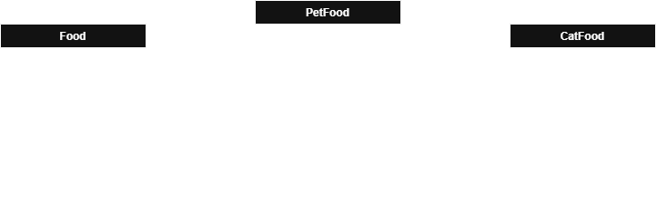
Dalam program ini, terdapat 3 kelas: 
  1. `Food`, kelas umum yang menyangkut semua macam makanan, baik untuk manusia maupun hewan. Maka dari itu, semua atribut disini juga dapat berlaku untuk segalan jenis makanan;
  2. `PetFood`, spesifikasi dari kelas `Food` yang mencakup semua makanan hewan peliharaan, termasuk kucing, anjing, ikan, unggas, dll. Atribut tambahan di kelas ini (tanggal kadaluarsa, SKU, berat) adalah karena makanan hewan pada umumnya diproduksi agar tahan lama, dan karena bermacam-macam merk-nya, diberikan SKU. Makanan hewan juga umumnya dijual berdasarkan berat;
  3. `CatFood`, spesifikasi lebih lanjut dari kelas `PetFood` yang hanya mencakup makanan untuk kucing. Atribut yang ada disini terlihat seperti bisa diletakkan di `PetFood`, namun pada nyatanya tidak. Makanan untuk ikan tidak dapat basah/terlalu lunak karena akan mengotori air. Lalu, tidak semua obat hewan dijual dalam bentuk makanan layaknya kucing. Terakhir, kucing merupakan salah satu hewan peliharaan yang makanannya memang ada yang diproduksi khusus untuk anak kucing.

# FITUR
1. Tambah data baru;
2. Lihat data;
3. Ubah data berdasarkan SKU;
4. Hapus data berdasarkan SKU;
5. Penyimpanan data berbasis `session` di implementasi *web*;
6. Pencarian data berdasarkan 'SKU' dan 'Nama' produk.

# ERROR HANDLING
*Error handling* dibawah berlaku untuk semua implementasi. Untuk implementasi Web, validasi diterapkan dua kali, yaitu pada masing-masing input dan ketika form di-*submit*. Saat terjadi *error*, program akan mengembalikan pesan dan meminta ulang *input* yang sesuai.
  1. Mencoba menambahkan SKU duplikat:
  
  | CLI | WEB |
  | --- | --- |
  | 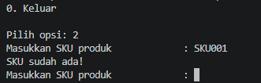 | 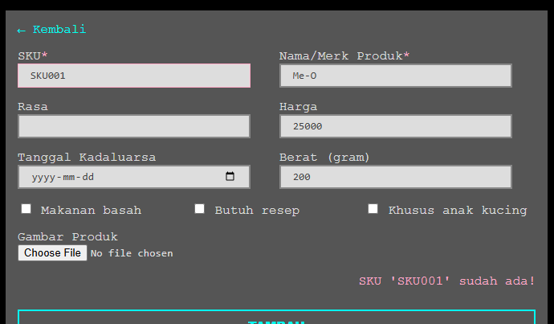 |
  2. Mencoba *input string* / karakter non-angka pada atribut angka:

  | CLI | WEB |
  | --- | --- |
  | 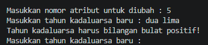 | 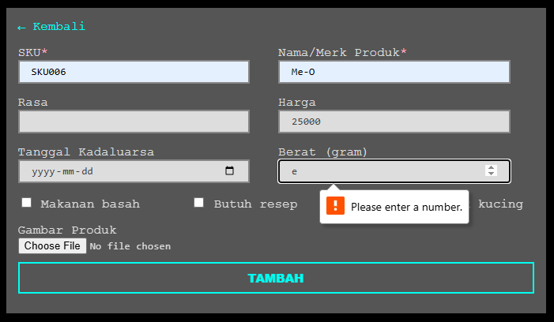 |
  3. Mencoba *input* angka negatif pada atribut angka (semua atribut angka harus positif atau 0):

  | CLI | WEB |
  | --- | --- |
  | 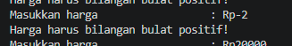 | 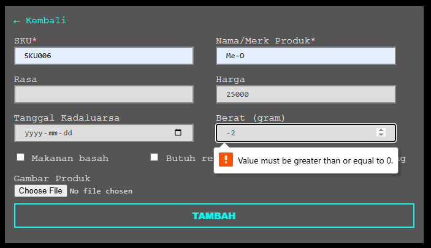 |
  4. Mencoba *input* angka desimal pada atribut angka (semua atribut angka harus bilangan bulat):

  | CLI | WEB |
  | --- | --- |
  | 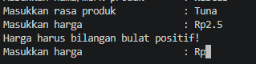 | 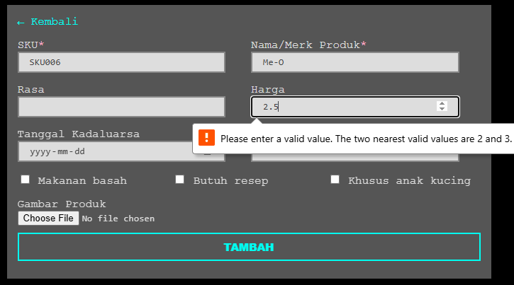 |
  5. Mencoba mengosongkan atribut 'SKU' atau 'Nama:

  | CLI | WEB |
  | --- | --- |
  | 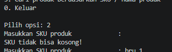 | 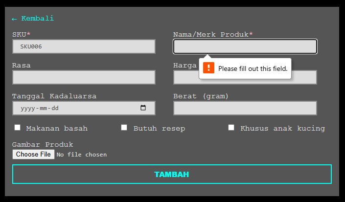 |
  6. Mencoba memasukkan nilai selain 'y'/'n' pada *input* boolean (CLI)

  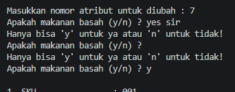

# DOKUMENTASI FITUR
1. Menambahkan data (+ *before* & *after*)

| CLI | WEB |
| --- | --- |
| 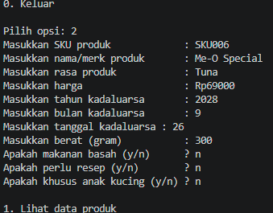 | 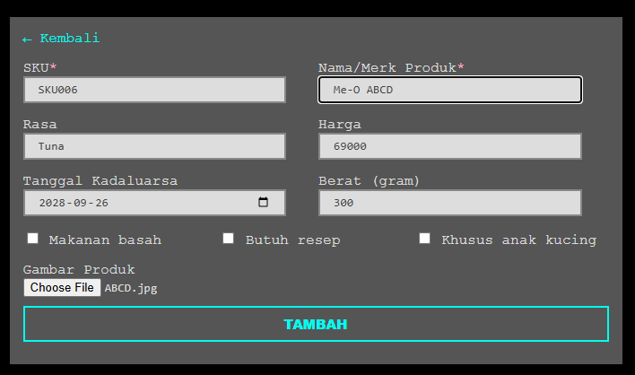 |
| 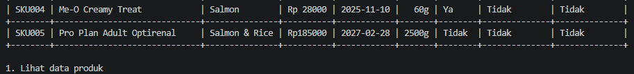 |  |
| 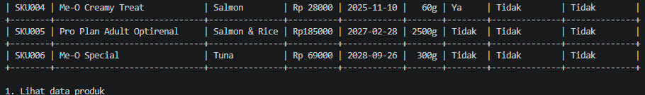 | 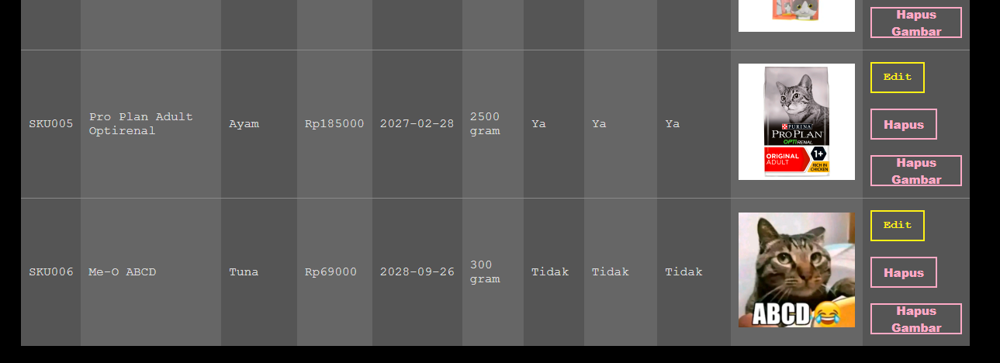 |
2. Melihat data

| CLI | WEB |
| --- | --- |
| 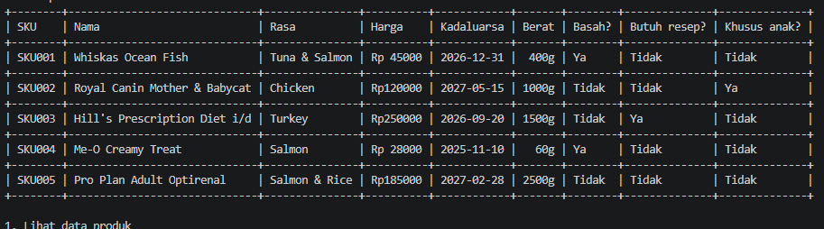 | 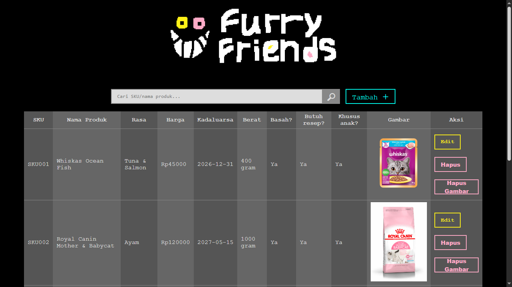 |
3. Mencari data. Pencarian dibuat berdasarkan judul atau nama direktor, dan bersifat *case-insensitive*

| CLI | WEB |
| --- | --- |
| 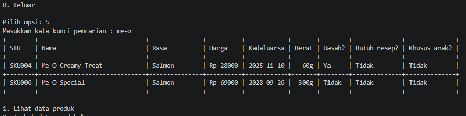 | 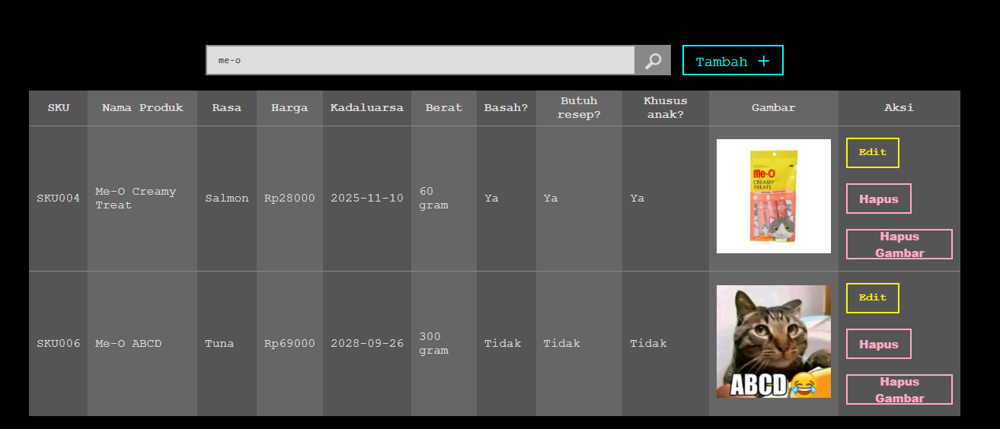 |
4. Merubah data (+ *before* & *after*)

| CLI | WEB |
| --- | --- |
| 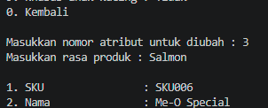 | 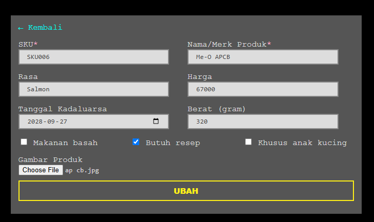 |
|  | 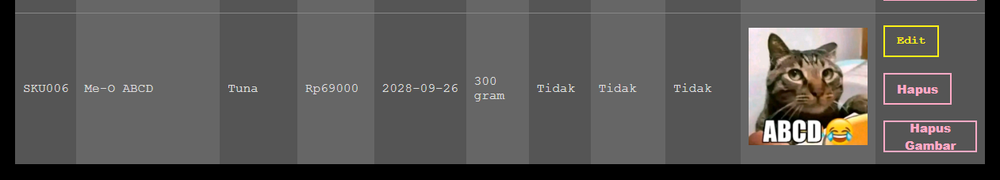 |
|  | 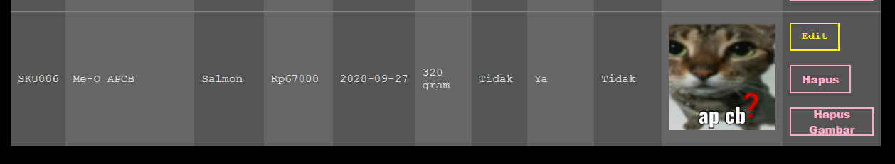 |
5. Menghapus data (+ *before* & *after*)

| CLI | WEB |
| --- | --- |
| 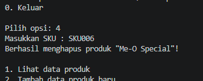 | 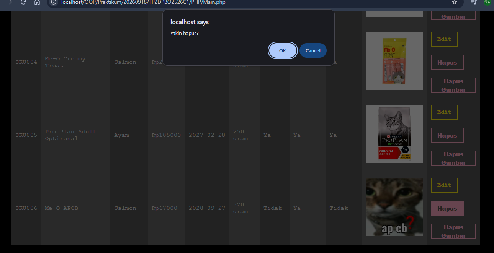 |
| 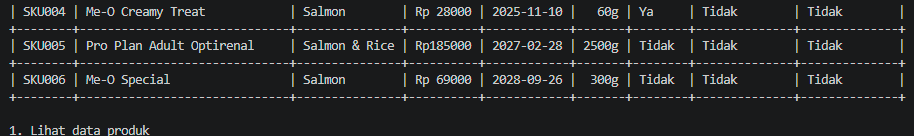 | 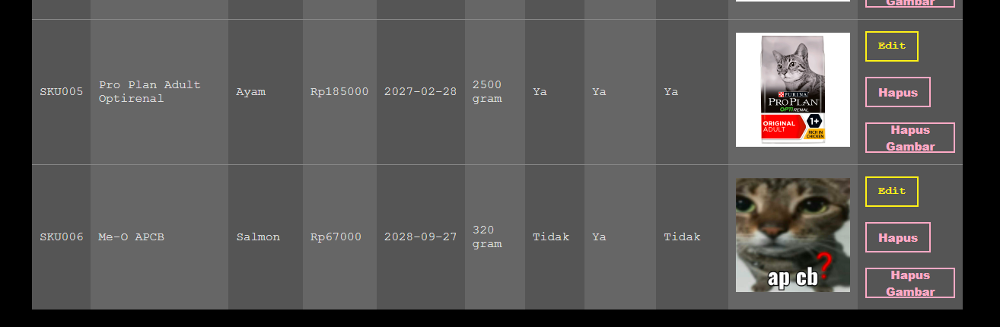 |
| 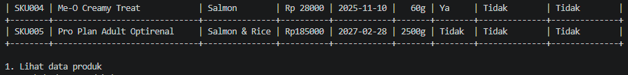 | 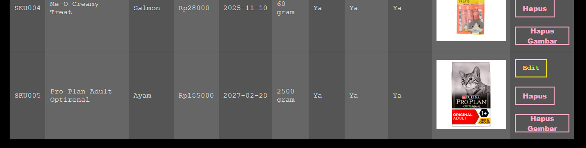 |

# CATATAN
Untuk Implementasi Web, pastikan membuka laman Main.php terlebih dahulu, karena data dummy diisi ketika masuk ke laman Main.php dalam keadaan belum ada data session. Pada laman create.php dan update.php, terdapat inisiasi session kosong untuk jaga-jaga, sehingga data dummy dari laman Main.php tidak akan masuk jika membuka laman create.php atau update.php terlebih dahulu. 

Jika sudah terlanjur membuka laman Create.php atau Update.php, maka hapus session dengan melakukan klik kanan, lalu Inspect -> Application -> Cookies, dan hapus session-nya.

